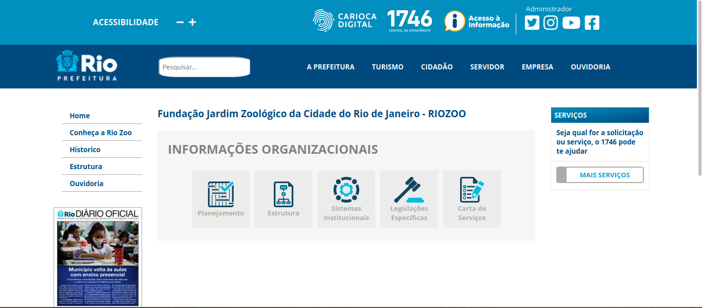
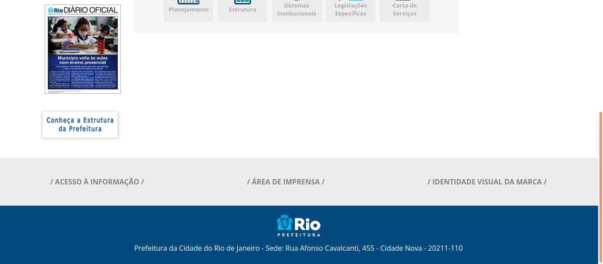

# Recriando uma página da prefeitura

Este projeto recria a [página do riozoo](https://www.rio.rj.gov.br/web/riozoo/) do site da prefeitura do Rio de Janeiro. São utilizados conceitos de CSS Flexbox e Grid Layout.

## :gear: Tecnologias

- HTML5
- CSS3

## :art: Layout

